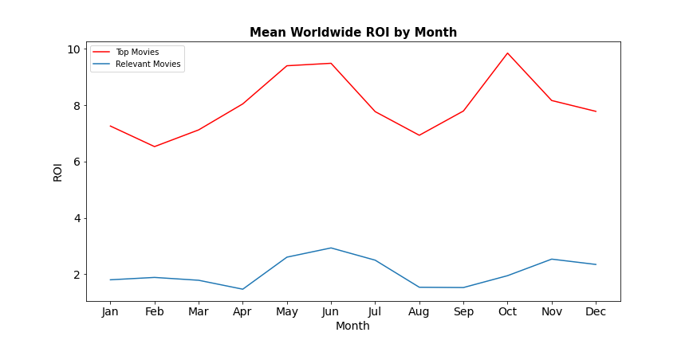

# Microsoft Studios Analysis

**Authors**: Lorela Blaka, Eric Denbin, Jesse Markowitz

## Overview

This project analyzes movie data in order to provide recommendations for Microsoft, which is opening a new production studio. We look for patterns and trends in return on investment (ROI) compared to budget and over time for both a general subset of movies as well as a selection of the most financially successful movies ("top movies"). We also examine the distribution of movie genres among all movies and the subset of top movies.

## Business Problem

We address the following business problems:

What is the optimal budget range to spend on a movie?
When during the year should movies be released to ensure a positive ROI?
Which genres are among the most successful?
Our analysis provides Microsoft with actionable insights for starting a successful movie studio.

## Data

We use The Numbers and IMDB as our 2 data sources. The Numbers is a movie blog focused on data. It has publicly available datasets containing historical financial information from the first movies dating back to 1915 through the present. IMDB has several datasets available of movie details, from which we pulled information on genre.

## Methods

The main metric we used was return on investment (ROI), which we calculated as (gross revenue - production budget)/production budget. After determing our metric we filtered out data based on boxplots showing the distribution of worldwide and domestic ROI, and a boxplot showing the distribution of production budget. We started our analysis by creating a slightly filtered subset of the ‘tn.movie_budgets’ dataset which we called ‘relevant_movies’. We used three filters to obtain this subset: Production Budget, Worldwide Gross, and Release Year. We filtered for movies above the 25th percentile in terms of production budget to reduce the amount of low budget results that skew the data. We also filtered for movies with worldwide gross revenue over $0 to exclude Netflix movies, which have no listed revenue. Lastly, we filtered out movies released after 2019 to remove any data that may have been affected by the covid-19 pandemic. From the subset 'relevant_movies', we created another subset for further analysis called 'top_movies'. We used two additional filters to create this subset: Worldwide ROI and Domestic ROI. We filtered for movies above the 75th percentile in both categories to study only the top quarter of 'relevant_movies' in terms of ROI.

## Results

There is a positive relationship between budget and the percentage of movies with a positive return, increasing to 93% in the range of 100 - 200 million dollars, and 97% in the range of 200 - 300 million dollars.


The highest mean worldwide ROI occurs in May, June, and October



Dramas, comedies, and action movies are the most common genres among successful movies(top_movies).


## Conclusions

This analysis leads to three recommendations for launching Microsoft Studios:

- **Budget in the range of $100 million–$300 million to have the best chance at getting a positive ROI.** In the $100-200m and $200-300m range, the proportion of movies with a positive return are highest, at 93% and 97%, respectively.
- **Maximize ROI by releasing movies in May, June, and October** We recommend planning to release in months when ROI is the highest. Notably, in May and June Worldwide ROI for Top Movies is ~9.5 and just above 4.6 for relevant movies. As well, in October, ROI peaks at ~9.9 for Top movies and in November, ROI peaks at 4.8 for relevant movies.
- **Prioritize production of dramas and comedies.** Although documentaries are very popular among all movies, these are rarely financially successful. Other genres more prevalent among top movies include action/adventure and horror/thriller/mystery.

## For More Information

See the full analysis in the [Jupyter Notebook](./microsoft_movie_needs_analysis.ipynb) or review this [presentation](./microsoft_movie_needs_presentation.pdf)

```
├── Code
│   ├── Eric––Project_1_Workbook.ipynb
│   ├── jmark_working_nb.ipynb
│   ├── lorela_working_nb.ipynb
│   
├── Data
├── Images
├── microsoft_movie_needs_analysis.ipynb
├── microsoft_movie_needs_presentation.pdf
└── README.md
```


